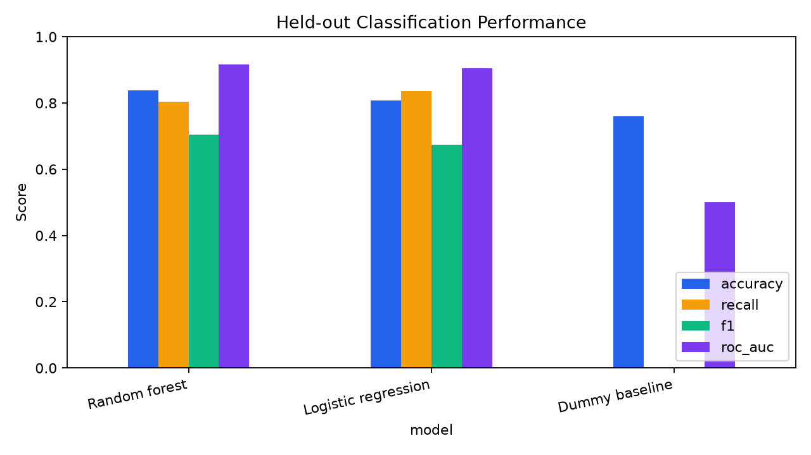
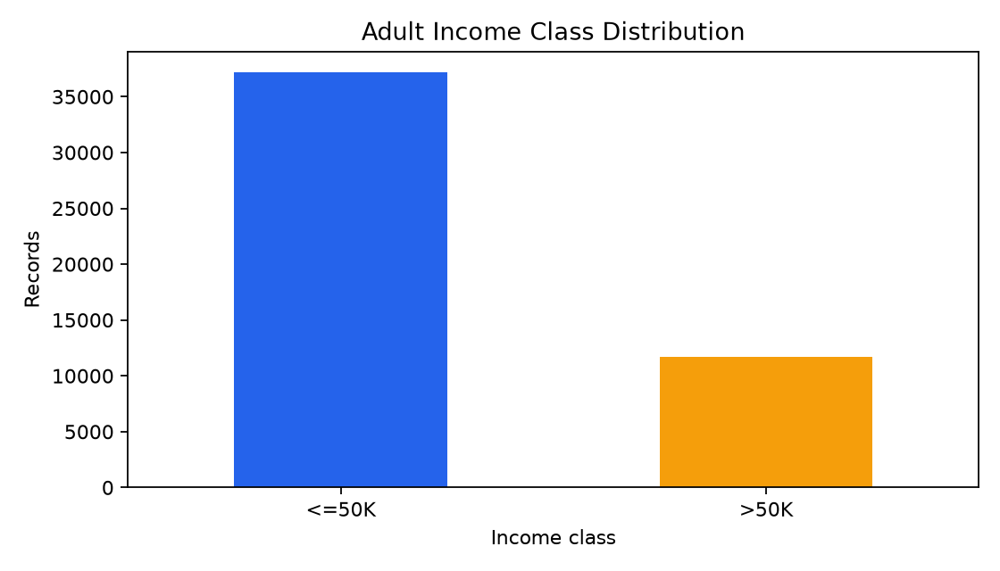
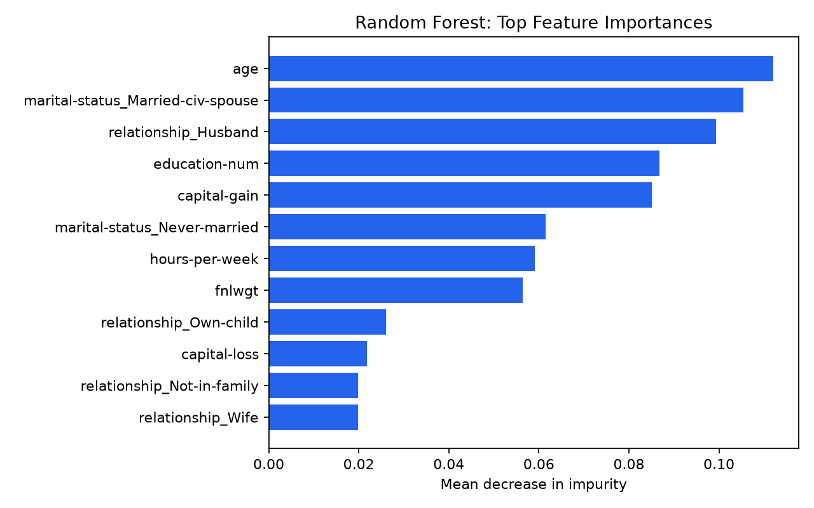

# CMPE 255 — Assignment 1

## Agent-Assisted Adult Income Data Science

This repository is an end-to-end, reproducible study of the [Adult/Census Income dataset](https://archive.ics.uci.edu/dataset/2/adult), a popular problem also available on [Kaggle](https://www.kaggle.com/datasets/jainaru/adult-income-census-dataset/data). It was built with OpenAI Codex and follows CRISP-DM from data understanding through evaluation and responsible interpretation.

> **YouTube walkthrough:** [Watch the complete end-to-end demonstration](https://youtu.be/ktyH8cvA3iw).

> **Supplemental walkthrough:** recording pending for the three newly added Part 2 replications. [Recording script and screen cues](docs/SUPPLEMENTAL_VIDEO_SCRIPT.md).

> **Medium article:** [Beyond Accuracy: What an Agent-Assisted Adult Income Project Actually Taught Me](https://medium.com/@bernie.miao/beyond-accuracy-what-an-agent-assisted-adult-income-project-actually-taught-me-03154ed71329?postPublishedType=initial).

## Deliverables

- **Part 1:** original Adult Income workflow—EDA, preprocessing, baseline, model comparison, feature importance, and written interpretation
- **Part 2:** [six mapped project replications](replications/) covering clustering, association mining, anomaly detection, AutoML, auditing, and forecasting
- **Artifacts:** measured CSV/JSON results and publication-ready figures under [`artifacts/`](artifacts/)
- **Process record:** [`docs/PROMPTS_AND_PROCESS.md`](docs/PROMPTS_AND_PROCESS.md)
- **Paraphrased report:** [`docs/RESULTS.md`](docs/RESULTS.md)
- **Medium article:** [Read the published article](https://medium.com/@bernie.miao/beyond-accuracy-what-an-agent-assisted-adult-income-project-actually-taught-me-03154ed71329?postPublishedType=initial)
- **YouTube walkthrough:** [Watch on YouTube](https://youtu.be/ktyH8cvA3iw)

## Results

The held-out test set contains 9,769 of the 48,842 records.

| Model | Accuracy | Precision | Recall | F1 | ROC-AUC |
|---|---:|---:|---:|---:|---:|
| Random forest | **0.8382** | **0.6263** | 0.8028 | **0.7037** | **0.9170** |
| Logistic regression | 0.8068 | 0.5651 | **0.8370** | 0.6747 | 0.9040 |
| Dummy baseline | 0.7607 | 0.0000 | 0.0000 | 0.0000 | 0.5000 |

The dummy baseline shows why accuracy alone is unsafe: it gets 76% accuracy but never identifies the `>50K` class. Random forest offers the best overall balance, while logistic regression trades more false positives for slightly higher recall.







## Part 2: Six creative project replications

The emailed requirement calls for at least six replications. This submission maps six experiments to the [reference repository](https://github.com/dlmastery/data_science_examples), with full evidence indexed under [`replications/`](replications/):

| # | Reference project | Local replication | Result |
|---:|---|---|---|
| 1 | 03 Customer Segmentation | Four-cluster MiniBatch K-means | Silhouette 0.2013 |
| 2 | 04 Associative Pattern Mining | Adult categorical association rules | 9 rules; top lift 1.8645 |
| 3 | 06 Anomaly Detection | Isolation Forest | 2,443 rows at configured 5% cutoff |
| 4 | 07 AutoML | Four-candidate automated benchmark | Best CV ROC-AUC 0.9169 |
| 5 | 11 Enterprise DS Audit | Leakage, reproducibility, and group checks | Material recall gap identified |
| 6 | 12 Time-Series Forecasting | AirPassengers seasonal-naive versus Ridge | Ridge MAPE 3.15% |

## Run it

Python 3.12+ is recommended.

```bash
python3 -m venv .venv
source .venv/bin/activate
python -m pip install -r requirements.txt
python -m unittest discover -s tests -v
python -m src.analysis
python -m src.replications
```

`python -m src.analysis` downloads the original UCI files into ignored local storage if they are missing and regenerates the root `artifacts/`. Run it before `python -m src.replications`, which reads those files and the committed AirPassengers data and writes results under the individual replication directories.

## Repository map

```text
.
├── artifacts/                 # Generated metrics, summaries, and figures
├── data/README.md             # Dataset provenance; raw downloads are ignored
├── docs/                      # Report and prompt/process record
├── replications/              # Six numbered Part 2 project replications
├── src/                       # Part 1 and Part 2 experiment code
├── tests/                     # Loading, cleaning, metrics, and output checks
├── requirements.txt
└── README.md
```

## Responsible-use conclusion

This is a teaching project, not a decision system. The data represents 1994 census-era patterns and contains sensitive attributes. In the held-out split, random-forest recall for the `>50K` class was 0.6567 for records marked female and 0.8300 for records marked male. That diagnostic alone is not a fairness verdict, but it is enough to reject use in employment, lending, benefits, or other consequential settings without substantially deeper work.

## Sources and attribution

- [CMPE 255 Assignment 1, Fall 2026](https://docs.google.com/document/d/1NMl64CxIyq3BznMgAFotEsp0fHpEkQe4b7Oi98SEjaA/edit?tab=t.0)
- [UCI Machine Learning Repository: Adult](https://archive.ics.uci.edu/dataset/2/adult)
- [Kaggle: Income Predictor Dataset — US Adult](https://www.kaggle.com/datasets/jainaru/adult-income-census-dataset/data)
- [Instructor reference examples](https://github.com/dlmastery/data_science_examples)
- [Reference prompt catalog](https://github.com/dlmastery/data_science_examples/blob/main/PROMPTS.md)

## Final publishing checklist

- [ ] Review the report and practice explaining every metric
- [x] Create a new public GitHub repository and push `main`
- [x] Record and upload the YouTube walkthrough
- [x] Add the YouTube URL to this README
- [x] Publish and link the Medium article
- [x] Verify the public GitHub and YouTube links
- [ ] Record and link the supplemental walkthrough for replications 04, 07, and 12
